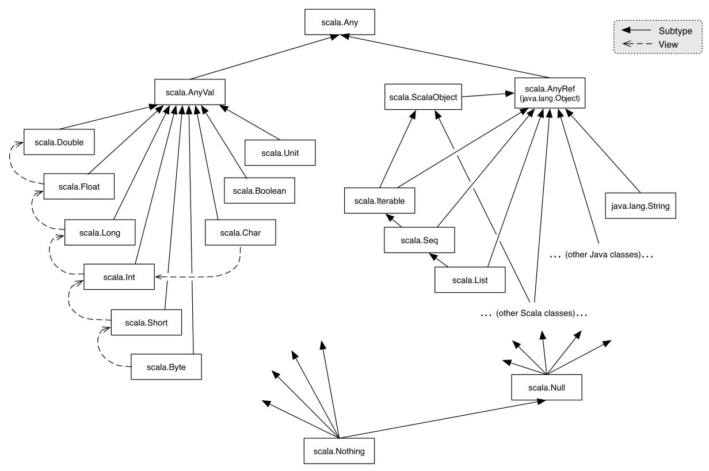

# Language Questions:

* ### What is Scala?

> Scala is Java based Hybrid programming language which is the fusion of both function and object-oriented programming language.

* ### Explain how Scala is both Functional and OOP language?

> Scala treats every single value as an object which even includes functions

* ### Mention differences between Scala and Java

> * All values are treated as object
> * Scala supports closures
> * Scala supports concurrency
> * It has Type-Inference
> * Scala can support Nested functions

* ### Write a few frameworks of Scala?

> * Akka
> * Spark
> * Play

* ### What is the difference between a `var`, a `val` and `def`?

> In short, the val and var are evaluated when defined, while def is evaluated on call. Also, val defines a constant, a fixed value that cannot be modified once declared and assigned while var defines a variable, which can be modified or reassigned.

* ### Explain the operators in Scala

> * Arithmetic operators
> * Relational operators
> * Logical operators
> * Bitwise operators
> * Assignment operators

* ### Explain the use of tuples in Scala

> A Tuple is an immutable data type and can hold objects with different types, unlike an array or list which are especially handy for returning multiple values from a method. Ex: ```scala val ingredient = ("Sugar" , 25)```

* ### Explain traits in Scala

> A Trait is defined as a unit used to encapsulate the methods and its variables. Classes and objects can extend traits, but traits cannot be instantiated and therefore have no parameters.

* ### What is the difference between a `trait` and an `abstract class`?

**Traits**|**Abstract Class**
:-----:|:-----:
Traits support multiple inheritance.|Abstract class does not support multiple inheritance.
We are allowed to add a trait to an object instance.|We are not allowed to add an abstract class to an object instance.
Traits does not contain constructor parameters.|Abstract class contain constructor parameters.
Traits are completely interoperable only when they do not contain any implementation code.|Abstract class are completely interoperable with Java code.
Traits are stackable. So, super calls are dynamically bound.|Abstract class is not stackable. So, super calls are statically bound.

* ### What is the difference between an `object` and a `class`?

> An `Object` is a class that has exactly one instance.
> Classes in Scala are blueprints for creating objects.

* ### What is `companion objects`?

> An object with the same name as a class is called a companion object.

* ### What is a `case class`?

> - Case classes can be used in pattern matching
> - Case classes automatically define hashcode and equals
> - Case classes automatically define getter methods for the constructor arguments.

* ### Why do we need `App` in Scala

> App is a helper class that holds the main method

* ### Explain the scope provided for variables in Scala

> * Fields
> * Method parameters
> * Local variables

* ### What is the difference between a Java future and a Scala future? The main inconvenience

> The main inconvenience of `java.util.concurrent.Future` is the fact that you can't get the value without blocking. In fact, the only way to retrieve a value is the get method, that ([quoting from the docs](https://docs.oracle.com/javase/7/docs/api/java/util/concurrent/Future.html))
`Waits if necessary for the computation to complete, and then retrieves its result.`
With `scala.concurrent.Future` you get instead a real non-blocking computation, as you can attach callbacks for completion (success/failure) or simply map over it and chain multiple Futures together in a monadic fashion. Long story short, scala's Future allows for asynchronous computation without blocking more threads than necessary.

* ### What is the difference between `unapply` and `apply`, when would you use them?

> when you treat your object like a function, apply is the method that is called.
> `unaply` deconstructs an instance of class, and is the foundation of pattern matching

* ### What is the difference between the following terms and types in Scala: `Nil`, `Null`, `None`, `Nothing`? The `None` is

> The `None` is the empty representation of the Option monad. `Null` is a Scala trait, where null is its only instance. The `null` value comes from Java, and it’s an instance of any object, i.e., it is a subtype of all reference types, but not of value types. It exists so that reference types can be assigned null and value types (like Int or Long) can’t.
`Nothing` is another Scala trait. It’s a subtype of any other type, and it has no subtypes. It exists due to the complex type system Scala has. It has zero instances. It’s the return type of method that never returns normally, for instance, a method that always throws an exception. The reason Scala has a bottom type is tied to its ability to express variance in type parameters… Finally, `Nil` represents an empty List of anything of size zero. `Nil` is of type `List[Nothing]`. All these types can create a sense of emptiness right? Here’s a little help to understand emptiness in Scala.


* ### What is the difference between `{}` and `()`?

* ### What is `Unit`?

> Unit is a type which represents the absence of value, just like Java void. It is a subtype of scala.AnyVal. There is only one value of type Unit, represented by (), and it is not represented by any object in the underlying runtime system.

* ### What is the difference between a `call-by-value` and `call-by-name` parameter?

> The difference between a call-by-value and a call-by-name parameter, is that the former is computed before calling the function, and the latter is evaluated when accessed.

_Example: If we declare the following functions_

```scala
def func(): Int = {
  println("computing stuff....")
  42 // return something
}

def callByValue(x: Int) = {
  println("1st x: " + x)
  println("2nd x: " + x)
}

def callByName(x: => Int) = {
  println("1st x: " + x)
  println("2nd x: " + x)
} 
```

and now call them:

```bash
scala> callByValue(func())
computing stuff....
1st x: 42
2nd x: 42

scala> callByName(func())
computing stuff....
1st x: 42
computing stuff....
2nd x: 42
```

> As it may be seen, the call-by-name example makes the computation only when needed, and every time it is called, while the call-by-value only computes once, but it computes before invoking the function (callByName).

* ### Define uses for the `Option` monad and good practices it provides.

> The Option monad is the Scala solution to the null problem from Java. While in Java the absence of a value is modeled through the null value, in Scala its usage is discouraged, in flavor of the Option. Using null values one might try to call a method on a null instance, because the developer was not expecting that there could be no value, and get a NullPointerException. Using the Option, the developer always knows in which cases it may have to deal with the absence of value.

```scala
val person: Person = getPersonByIdOnDatabaseUnsafe(id =
  4
) // returns null if no person for provided id
println(
  s"This person age is ${person.age}"
) // if null it will throw an exception

val personOpt: Option[Person] = getPersonByIdOnDatabaseSafe(id =
  4
) // returns an empty Option if no person for provided id

personOpt match {
  case Some(p) => println(s"This person age is ${p.age}")
  case None => println("There is no person with that id")
}
```

* ### How does `yield` work?

> yield generates a value to be kept in each iteration of a loop. yield is used in for comprehensions as to provide a syntactic alternative to the combined usage of map/flatMap and filter operations on monads

```bash
scala> for (i <- 1 to 5) yield i * 2
res0: scala.collection.immutable.IndexedSeq[Int] = Vector(2, 4, 6, 8, 10)
```

* ### Explain the implicit parameter precedence.

> Implicit parameters can lead to unexpected behavior if one is not aware of the precedence when looking up.
> So, what’s the order the compiler will look up for implicits?

* implicits declared locally
* imported implicits
* outer scope (implicits declared in the class are considered outer scope in a class method for instance)
* inheritance package object implicit scope like companion objects A nice set of examples can be found here.

* ### What operations is a `for comprehension` syntactic sugar for?

> A for comprehension is an alternative syntax for the composition of several operations on monads.
> A for comprehension can be replaced by foreach operations (if no yield keyword is being used), or by map/flatMap and filter (actually, while confirming my words I found out about the withFilter method).

```scala
for {
  x <- c1
  y <- c2
  z <- c3 if z > 0
} yield ???
```

is translated into

```scala
c1.flatMap(x =>
  c2.flatMap(y =>
    c3.withFilter(z => z > 0)
      .map(z => {
        ???
      })
  )
)
```

[More about for comprehension](help/forcomprehension.md)

* ### Streams:

> Stream is a lazy list that evaluates items only when needed.
> While Scala Streams can be really useful due to its lazy nature, it may also come with some unexpected problems.
> The biggest problem is that Scala Streams can be infinite, but your memory isn’t. If used wrongly, streams can lead to memory consumption problems. One must be cautious when saving references to a stream. One common guideline, is not to assign a stream (head) to a val, but instead, make it a def.
> This is a consequence of the technique behind streams: memoization

* ### What is a Closure

> Closure is considered as a function whose return value is depends on the value of one or more variable declared outside of this function
